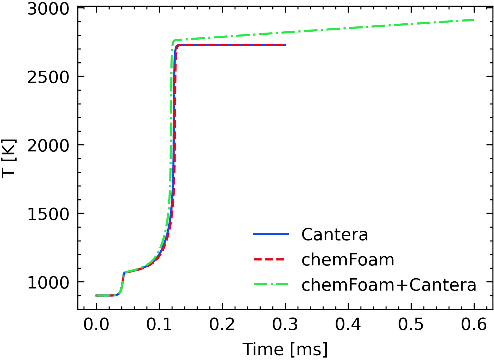
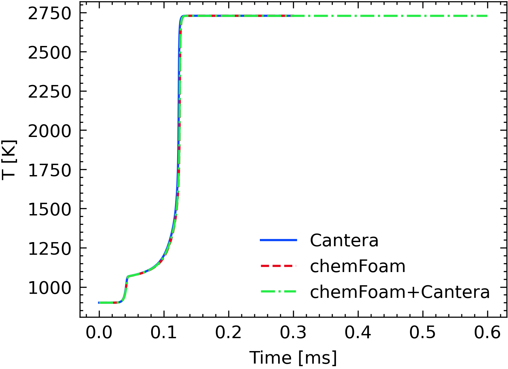

# CanteraChemistryModel

using Cantera to calculate species reaction rates for OpenFOAM.


But! Now the result is wrong!



Now I have fixed it! (20210624, midsummer eve)

The problem is the mismatch between concentration calculated by OpenFOAM and by Cantera. 

## How to compile
```
tar -zxvf cantera_build.tar.gz
cd cantera_build/lib
tar -zxvf libcantera_shared2.5.2.so.tar.gz
ln -s libcantera_shared2.5.2.so libcantera_shared.so.2
cd ../..
wmake
```

## How to use
```
export LD_LIBRARY_PATH=/path_to_cantera_build/lib:$LD_LIBRARY_PATH
export CANTERA_DATA=/path_to_cantera_build/cantera_build/data
chemFoam
```